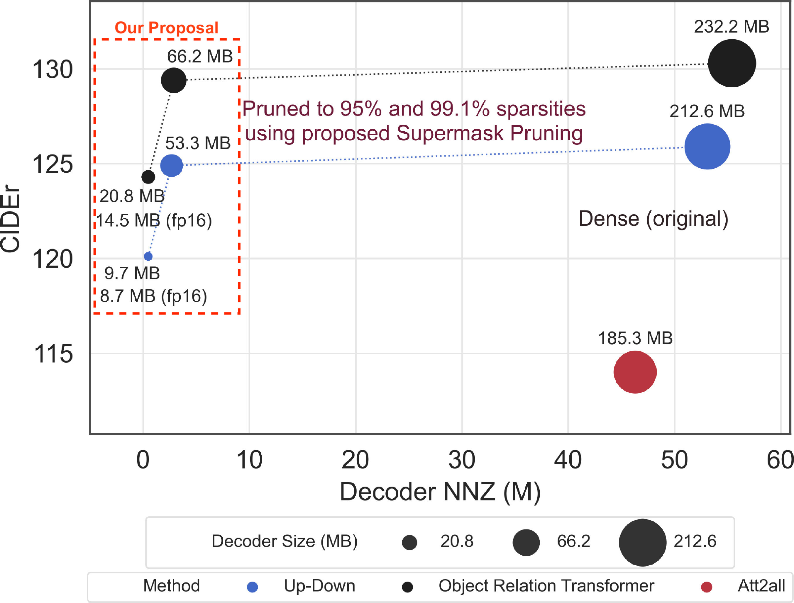

# Learning to Prune Image Captioning Models


[PDF](https://www.sciencedirect.com/science/article/pii/S003132032100546X) | [ArXiv](https://arxiv.org/abs/2110.03298)

### Official pytorch implementation of the paper: "End-to-End Supermask Pruning: Learning to Prune Image Captioning Models"

#### Published at Pattern Recognition, Elsevier

Released on July 20, 2021

# Description

This work explores model pruning for image captioning task at the first time. Empirically, we show that 80% to 95% sparse networks can either match or even slightly outperform their dense counterparts. In order to promote Green Computer Vision, we release the pre-trained sparse models for UD and ORT that are capable of achieving CIDEr scores >120 on MS-COCO dataset; yet are only 8.7 MB (reduction of 96% compared to dense UD) and 14.5 MB (reduction of 94% compared to dense ORT) in model size.

<p align="center">  </p>
<p align="center"> Figure 1: We show that our deep captioning networks with 80% to 95% sparse are capable to either match or even slightly outperform their dense counterparts.</p>


## Features

* Captioning models built using PyTorch
    * [Up-Down LSTM](http://openaccess.thecvf.com/content_cvpr_2018/html/Anderson_Bottom-Up_and_Top-Down_CVPR_2018_paper.html)
    * [Object Relation Transformer](https://papers.nips.cc/paper/9293-image-captioning-transforming-objects-into-words.pdf)
    * A Compact Object Relation Transformer (ACORT)
* Unstructured weight pruning
    * Supermask (end-to-end pruning)
    * Gradual magnitude pruning
    * Lottery ticket
    * One-shot magnitude pruning
    * Single-shot Network Pruning (SNIP)
* Self-Critical Sequence Training (SCST)
    * Random sampling + Greedy search baseline: [vanilla SCST](https://openaccess.thecvf.com/content_cvpr_2017/html/Rennie_Self-Critical_Sequence_Training_CVPR_2017_paper.html)
    * Beam search sampling + Greedy search baseline: à la [Up-Down](http://openaccess.thecvf.com/content_cvpr_2018/html/Anderson_Bottom-Up_and_Top-Down_CVPR_2018_paper.html)
    * Random sampling + Sample mean baseline: ("new SCST" in `ruotianluo/self-critical.pytorch`)
    * Beam search sampling + Sample mean baseline: à la [M2 Transformer](http://openaccess.thecvf.com/content_CVPR_2020/html/Cornia_Meshed-Memory_Transformer_for_Image_Captioning_CVPR_2020_paper.html)
    * Optimise CIDEr and/or BLEU scores with custom weightage
    * Based on [ruotianluo/self-critical.pytorch](https://github.com/ruotianluo/self-critical.pytorch/tree/3.2)
* Multiple captions per image during teacher-forcing training
    * Reduce training time: run encoder once, optimize on multiple training captions
* Incremental decoding (Transformer with attention cache)
* Data caching during training
    * Training examples will be cached in memory to reduce disk I/O
    * With sufficient memory, the entire training set can be loaded from memory after the first epoch
    * Memory usage can be controlled via `cache_min_free_ram` flag
* `coco_caption` in Python 3
    * Based on [salaniz/pycocoevalcap](https://github.com/salaniz/pycocoevalcap/tree/ad63453cfab57a81a02b2949b17a91fab1c3df77)
* Tokenizer based on `sentencepiece`
    * Word
    * [Radix encoding](https://github.com/jiahuei/COMIC-Compact-Image-Captioning-with-Attention)
    * _(untested)_ Unigram, BPE, Character
* Datasets
    * MS-COCO
    * _(to be added)_ Flickr8k, Flickr30k, InstaPIC-1.1M


## Pre-trained Sparse and ACORT Models

The checkpoints are [available at this repo](https://github.com/jiahuei/sparse-captioning-checkpoints).

Soft-attention models implemented in TensorFlow 1.9 are available at [this repo](https://github.com/jiahuei/tf-sparse-captioning).


## Main Requirements

* python == 3.7, 3.8
* pytorch >= 1.6
* sentencepiece >= 0.1.91
* torchvision >= 0.7.0

See the rest in `requirements_base.txt` and `requirements.txt`

On Windows, you might need to install "Microsoft C++ Build Tools" in order to build `pycocotools`, 
by [downloading from this link](https://visualstudio.microsoft.com/visual-cpp-build-tools/)


## Setup

For convenience, setup is done using Docker.

1. Run `docker build -t jiahuei/pytorch:1.6.0-java8 -f Dockerfile .` to build the Docker image.
2. Run `bash docker_run.sh` to launch a container. Edit paths in the script as needed.
3. In the container, run `python /master/src/scripts/dataset/setup.sh` to perform dataset pre-processing.
4. Done


## Usage

Refer to `resources/commands_pruning.sh` and `resources/commands_acort.sh` for more examples.

These paths below assume a Docker setup following `docker_run.sh`.

### Training
```shell script
# Baseline dense
MODEL_TYPE="up_down_lstm"
MODEL_ID="UpDownLSTM"
SCHEDULER="cosine"

python /master/src/scripts/train_transformer.py \
    --caption_model ${MODEL_TYPE} \
    --dataset_dir ${DATASET_DIR} \
    --log_dir ${LOG_DIR} \
    --lr_scheduler ${SCHEDULER} \
    --learning_rate 0.01 \
    --optim_epsilon 0.01 \
    --id ${MODEL_ID}__baseline \
    --cache_min_free_ram ${CACHE_FREE_RAM}

# Pruning
MODEL_TYPE="up_down_lstm_prune"

for PRUNE_SPARSITY_TARGET in 0.9875 0.975 0.95; do
    for PRUNE_WEIGHT in 40 80 120; do
        python /master/src/scripts/train_n_prune_transformer.py \
            --caption_model ${MODEL_TYPE} \
            --dataset_dir ${DATASET_DIR} \
            --log_dir ${LOG_DIR} \
            --lr_scheduler ${SCHEDULER} \
            --learning_rate 0.01 \
            --optim_epsilon 0.01 \
            --drop_prob_lm 0.1 \
            --prune_type supermask \
            --prune_sparsity_target ${PRUNE_SPARSITY_TARGET} \
            --prune_supermask_sparsity_weight ${PRUNE_WEIGHT} \
            --id ${MODEL_ID}__${PRUNE_TYPE}__${PRUNE_SPARSITY_TARGET} \
            --cache_min_free_ram ${CACHE_FREE_RAM}
    done
done
```

### Inference
To evaluate the models, simply run:
```shell script
python /master/src/scripts/eval_model.py \
    --log_dir ${LOG_DIR} \
    --beam_size_test 2 \
    --id RTrans__supermask__0.9875__wg_80.0
```


## MS-COCO Online Evaluation

To perform online server evaluation:
1. Run `python /master/src/scripts/eval_model.py` with `--mscoco_online_test` option.
    For example:
    ```shell script
    python /master/src/scripts/eval_model.py \
        --log_dir ${LOG_DIR} \
        --beam_size_test 5 \
        --mscoco_online_test \
        --id ${ID}
    ```
2. Rename the JSON files to `captions_test2014__results.json` and `captions_val2014__results.json`.
    * `captions_val2014__results.json` will contain fake captions, just there to fulfil submission format
3. Zip the files and [submit](https://competitions.codalab.org/competitions/3221#participate).


## Visualisation

You can explore and visualise generated captions [using this Streamlit app](https://github.com/jiahuei/MSCOCO-caption-explorer).


## Acknowledgements

* SCST, Up-Down: [ruotianluo/self-critical.pytorch](https://github.com/ruotianluo/self-critical.pytorch/tree/3.2)
* Object Relation Transformer: [yahoo/object_relation_transformer](https://github.com/yahoo/object_relation_transformer)
* `coco_caption` in Python 3: [salaniz/pycocoevalcap](https://github.com/salaniz/pycocoevalcap/tree/ad63453cfab57a81a02b2949b17a91fab1c3df77)


## Notes

### `pycocotools` installation issues

* One might run into issues related to `numpy` or `cython` when importing `pycocotools`.
* To resolve it, either:
    * Install `numpy` and `cython` prior to installing `pycocotools`
    * Maybe try `pycocotools-fix` instead
* This issue may lead to GitHub CI failing, if a different `numpy` version is reinstalled after `pycocotools` is built

## Citation
If you find this work useful for your research, please cite
```
@article{tan2021end,
  title={End-to-End Supermask Pruning: Learning to Prune Image Captioning Models},
  author={Tan, Jia Huei and Chan, Chee Seng and Chuah, Joon Huang},
  journal={Pattern Recognition},
  pages={108366},
  year={2021},
  publisher={Elsevier},
  doi={10.1016/j.patcog.2021.108366}
}
```

## Feedback
Suggestions and opinions on this work (both positive and negative) are greatly welcomed. Please contact the authors by sending an email to
`tan.jia.huei at gmail.com` or `cs.chan at um.edu.my`.

## License and Copyright
The project is open source under BSD-3 license (see the ``` LICENSE ``` file).

&#169;2021 Universiti Malaya.

