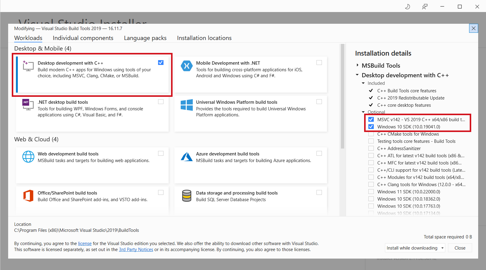

# Get Started

## TL;DR

1. Clone the repo: `git clone https://github.com/jiahuei/sparse-image-captioning.git`
2. Change directory: `cd sparse-image-captioning`
3. Install the package using either:
   * Regular: `pip install .`
   * Editable mode: `pip install -e .`
4. Install Java 8
5. Test installation: `import sparse_caption`
6. Run `bash scripts/dataset/setup.sh` to perform dataset download, pre-processing, and feature extraction
7. Done


## Requirements

The main requirements for `sparse_caption` are as follows:

* python
* pytorch
* sentencepiece
* torchvision
* Java 8

The full list of required packages can be found `requirements_base.txt` and `requirements.txt`.

```{admonition} Dependency Versions
The exact dependency versions that are tested can be found in `requirements_dev_base.txt` and `requirements_dev.txt`.
```


## Installation and Setup

### Docker
Setup using Docker is the most convenient.

1. Clone the repo: `git clone https://github.com/jiahuei/sparse-image-captioning.git`
2. Change directory: `cd sparse-image-captioning`
3. Run `docker build -t <YOUR_TAG> -f Dockerfile .` to build the image
4. Run the command below to launch a container. **Change `<YOUR_DATASET_PATH>` to your desired path.** All dataset files will be placed inside `<YOUR_DATASET_PATH>`.
   ```bash
    docker run -it \
        --gpus all \
        --ipc=host \
        -v .:/workspace \
        -v <YOUR_DATASET_PATH>:/datasets \
        -v /tmp/.X11-unix:/tmp/.X11-unix -e DISPLAY=$DISPLAY \
        --rm <YOUR_TAG>
   ```
5. Test installation: `import sparse_caption`
6. In the container, run `bash /workspace/scripts/dataset/setup.sh` to perform dataset download, pre-processing, and feature extraction
7. Done

```{warning}
Upon container launch, the `sparse_caption` package will be installed in editable mode.

Thus, the repository directory should be mounted to `/workspace` in the container.
```

### Pip

See [TL;DR](get_started.md#TL;DR)

```{admonition} Windows
1. On Windows, you might need to install "Microsoft C++ Build Tools" in order to build `pycocotools`, 
by [downloading from this link](https://visualstudio.microsoft.com/visual-cpp-build-tools/).

2. Tick the options as shown:
    
```

### Anaconda

1. These commands should install the required packages:
    ```bash
    conda install h5py matplotlib pandas Pillow scipy seaborn tqdm
    # conda install pytorch torchvision torchaudio cudatoolkit=10.2 -c pytorch
    conda install pytorch torchvision torchaudio cpuonly -c pytorch
    conda install -c pytorch torchtext
    conda install -c fastai sentencepiece
    conda install -c conda-forge tensorboard six

    # For dev, optional
    conda install pytest
    conda install -c conda-forge black doc8 myst-parser sphinx sphinx-autobuild sphinx_rtd_theme
    ```
2. Follow [TL;DR](get_started.md#TL;DR)

```{admonition} Possible *pycocotools* installation issues
* One might run into issues related to `numpy` or `cython` when importing `pycocotools`.
* To resolve it, either:
    * Install `numpy` and `cython` prior to installing `pycocotools`
    * Maybe try using `pycocotools-fix` instead
```
